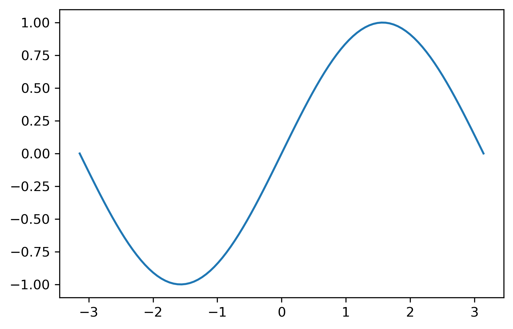
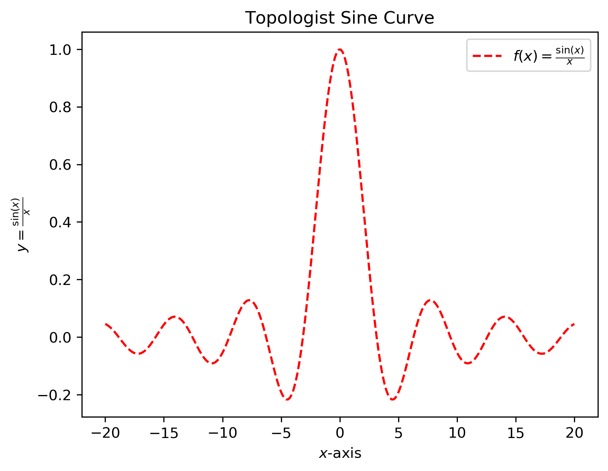
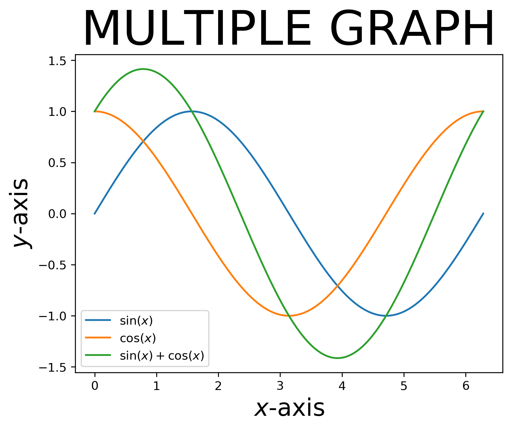

# Day 1

The agenda of today is the following.

[TOC]

## Defining variable

To define a varaible just choose a varaible name and asign it to a value using `=` as follows

``` python
x = 24 # an integer
pi = 3.14 # a float
name = "Sandeep Suman" # a string
```

**Ex:** Choose three variable and assign each one as an integer, a float and a string, and print them.

## Matheamtical Operations

Mathematical operations, i.e., addition, substraction etc. can be defined as 

``` python
5 + 6 # addition
5 - 6 # substraction
5 * 6 # multiplication
5 / 6 # division
5 ** 6 # exponent or power
```

**Ex:** Choose two variable `x` and `y` and assign each one as integer. Try each of the following operations on them like `x+y`. Finally print them

``` python
x = 2 
y = 3
z = x + y
print(z)
```

```
5
```

### Mathematical Expression

We can use these operations to 4 complicated mathematical expressions in python, for example, we can evaluate 
$$ f(x) = \frac{x^2 + 1}{y-1} $$
as follows

``` python 
x = 5 
y = 3
z = (x**2 + 1) / (y-1)
print(z)
```

```
13
```

## Importing Libraries

To increase the functiionality of any language we use libraries or pre written code. 

A very useful library in python is called `numpy` which is used to do numerical calculation in python. In order to import a library in python you can use any of the following methods.

``` python
import numpy # method 1 
import numpy as np # method 2
from numpy import * # method 3
```

Any library has some function or variable included in them. for example `numpy` library has mathematical sine function as `sin` and variable `pi`. For each method these things can be accessed as follows

**Method 1:** In order to import the function and variable we will do the following 

``` python
import numpy
print(numpy.pi) # prints the value of pi
print(numpy.sin(numpy.pi)) # prints the sin(pi)
```

**Method 2:** In order to import the function and variable we will do the following 

``` python
import numpy as np
print(np.pi) # prints the value of pi
print(np.sin(np.pi)) # prints the sin(pi)
```

**Method 3:** In order to import the function and variable we will do the following 

``` python
from numpy import *
print(pi) # prints the value of pi
print(sin(pi)) # prints the sin(pi)
```

!!! tip
    Each method has its own advantages and disadvantages but for this course we will use the second method only.

## Plotting simple function in python

To plot simple functions in python we use `numpy` and `matplotlib` libraries and three functions. 

- `linspace` from `numpy`
    The function `linspace` is used to generate a number of equidistant points on a line inteval. It takes three arguments.

    `linspace(x,y,n)` will generate a list of n points between x and y.

    **Ex:** Create 100 equally spaced points between $-\pi/2$ and $\pi/2.$

- `plot` from `matplotlib.pyplot` 
    This is the function used to make a plot. It requires two argument.

    `plot(x,y)` will list of elements x versus y

- `show` from `matplotlib.pyplot`
    This functin will show the final plot. It is simply invoked by typin `show()`

### Simple Plots

Now we have understood the basic components used to plot a function in python. Now we will see them together in a simple example by plotting the function $\sin(x)$ between $-\pi$ to $\pi$. 

``` python
import numpy as np
import matplotlib.pyplot as plt
x = np.linspace(-np.pi, np.pi, 100)
y = np.sin(x)
plt.plot(x,y)
plt.show()
```



**Ex:** Plot the following function in the interval $(1,10)$

- $\sin^2(x) + cos(x)$
- $2x^2 + 1$ 

### Adding Attributes in Plots

The graph shows visual information in a small space in the form of an image. The representation can be improved by adding app tributes like title legends and other things.

- Modify the *attributes* of a *plot* like *color, line width, line style* by passing additional *arguments.*

	`plt.plot(x, y,color='blue')` this will make the graph blue 

- Add *title* to a *plot* using *title command.*

	`plt.title('Derivative Graph')` this will make a title of the graph

- Incorporate *LaTeX style formatting* by adding a $ sign before and after the *string.*

	`plt.plot(x,f(x),label='$f(x)=tan(x^2)$')`

- Label *x* and *y* *axes* using *xlabel()* and *ylabel() commands.*

	``` python 
  plt.xlabel('x values')
	plt.ylabel('y values')
  ```

- Add *annotations* to a plot using *annotate() command.*

- Get and set the *limits of axes* using *xlim()* and *ylim() commands.*

**Example using all these attributes together:** 

``` python
import numpy as np
import matplotlib.pyplot as plt

x = np.linspace(-20, 20., 250)
y = np.sin(x) / x


plt.plot(x, y, color='red', linestyle='dashed')
plt.xlabel("$x$-axis")
plt.ylabel(r"$y = \frac{\sin(x)}{x}$")
plt.legend([r"$f(x)=\tan(x^2)$"])
plt.title(r"Topologist Sine Curve")

plt.show()
```



**Ex:** Draw a *plot* of *cosine graph* between $-2\pi$ to $2\pi$ with line thickness $4$ in blue colour.

### Saving Plots

In order to save plots in the local directory we use `savefig` function. The plot can be save in the following format. 

- pdf 
- ps 
- png 
- svg 
- eps

To save the figure in currrent working directory use the code. 

``` python 
plt.savefig("myplot.png")
```
To save the plot of topologist sine curve I have used the following 

``` python
plt.savefig('/Users/ssuman/Downloads/topologist-sine.png', dpi=300, bbox_inches='tight')
```

## More Things to Explore 

- Multiple plots

  ``` python
  import numpy as np 
  import matplotlib.pyplot  as plt

  x=np.linspace(0,2*np.pi,400)
  a=np.sin(x)
  b=np.cos(x)
  c=a+b
  
  plt.plot(x,a, label='sin(x)' )
  plt.plot(x,b, label='cos(x)')
  plt.plot(x,c, label='sin(x)+cos(x)')
  plt.xlabel('x-axis', fontsize=20)
  plt.ylabel('y-axis', fontsize=20)
  plt.title('MULTIPLE GRAPH' ,fontsize=40)
  plt.legend()
  plt.savefig('multiplegraph.png')
  plt.show()
  ```

  

- Subplots

## References

1. [:material-file-outline: Official Python Refererence](https://docs.python.org/3/)
2. [:material-file-outline: Matplotlib Documentation](https://matplotlib.org/3.2.1/contents.html#)
3. [:material-video-outline: Basic Math, Mathematical Operators and Python Expressions](https://www.youtube.com/watch?v=Os4gZUI1ZlM)
4. [:material-file-outline: Gallery Matplotlib](https://matplotlib.org/3.1.1/gallery/index.html)
