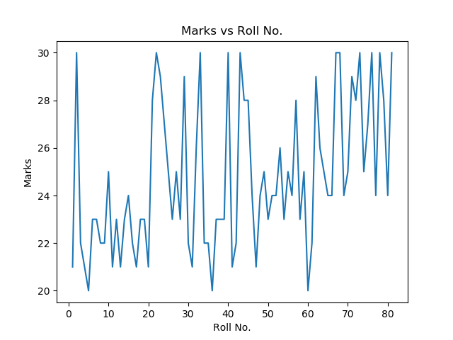
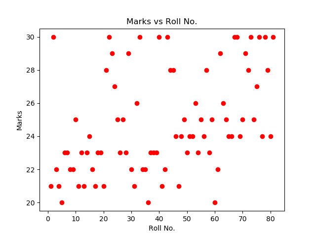
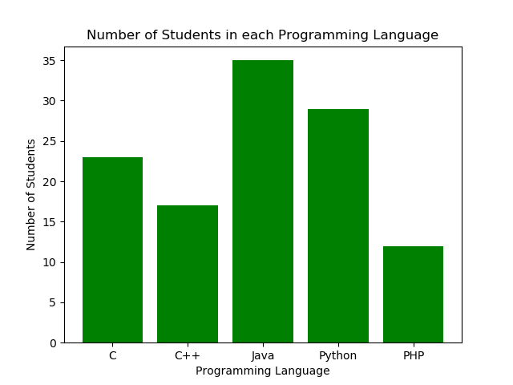
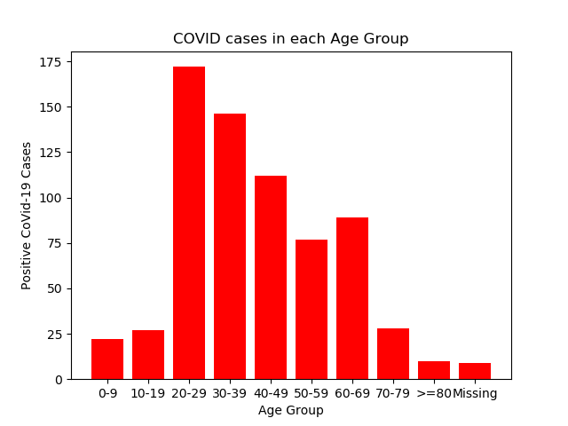
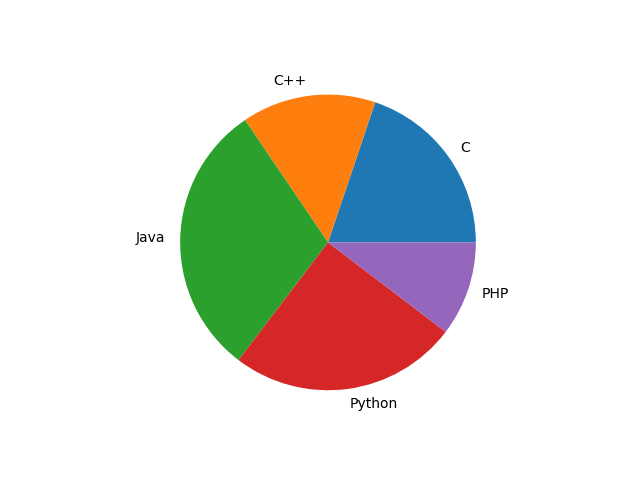

# Day 2

[TOC]

## Loading data from files

To load the data from external text or CSV file we have to use `loadtxt` function from the `numpy` library. This function will store the column into the lists in python, which can be further processed in the program.

### Single Column File

A single comma separated row file can be read as the following. Let [primes.txt](./data/primes.txt) stores the data consist of first 100 prime numbers separated by comma.

``` shell
cat primes.txt
```

```
2, 3, 5, 7, 11, 13, 17, 19, 23, 29, 31, 37, 41, 43, 47, 53, 59, 61, 67, 71, 73, 79, 83, 89, 97, 101, 103, 107, 109, 113, 127, 131, 137, 139, 149, 151, 157, 163, 167, 173, 179, 181, 191, 193, 197, 199, 211, 223, 227, 229, 233, 239, 241, 251, 257, 263, 269, 271, 277, 281, 283, 293, 307, 311, 313, 317, 331, 337, 347, 349, 353, 359, 367, 373, 379, 383, 389, 397, 401, 409, 419, 421, 431, 433, 439, 443, 449, 457, 461, 463, 467, 479, 487, 491, 499, 503, 509, 521, 523, 541
```

To read this data and store all the values in a list named primes we use the following command

``` python
import numpy as np 

primes = np.loadtxt("primes.txt", delimiter=',')
print(primes)
```

```
[  2.   3.   5.   7.  11.  13.  17.  19.  23.  29.  31.  37.  41.  43.
  47.  53.  59.  61.  67.  71.  73.  79.  83.  89.  97. 101. 103. 107.
 109. 113. 127. 131. 137. 139. 149. 151. 157. 163. 167. 173. 179. 181.
 191. 193. 197. 199. 211. 223. 227. 229. 233. 239. 241. 251. 257. 263.
 269. 271. 277. 281. 283. 293. 307. 311. 313. 317. 331. 337. 347. 349.
 353. 359. 367. 373. 379. 383. 389. 397. 401. 409. 419. 421. 431. 433.
 439. 443. 449. 457. 461. 463. 467. 479. 487. 491. 499. 503. 509. 521.
 523. 541.]
```

!!! warning
    The `loadtxt` function get only the data that can be converted into numbers. To get the data in other types we have to pass the type of data as an optional argument. For example

    ``` python
    age_group = np.loadtxt("fruits.txt",dtype=np.str)
    ```


### Multi Columns File 

Suppose we want to load a [marks.csv](./data/marks.csv) that consist of two columns with a header as follows

``` shell
head marks.csv
```

``` shell
Roll No.,Marks
1,21
2,30
3,22
4,21
5,20
6,23
7,23
8,22
9,22
```

To read each column as a separate list and skipping the first row, we can use the following,

``` python
import numpy as np 

roll_no, marks = np.loadtxt("marks.csv", delimiter=',', skiprows=1, unpack=True)
print(roll_no, marks)
```

``` shell
[ 1.  2.  3.  4.  5.  6.  7.  8.  9. 10. 11. 12. 13. 14. 15. 16. 17. 18.
 19. 20. 21. 22. 23. 24. 25. 26. 27. 28. 29. 30. 31. 32. 33. 34. 35. 36.
 37. 38. 39. 40. 41. 42. 43. 44. 45. 46. 47. 48. 49. 50. 51. 52. 53. 54.
 55. 56. 57. 58. 59. 60. 61. 62. 63. 64. 65. 66. 67. 68. 69. 70. 71. 72.
 73. 74. 75. 76. 77. 78. 79. 80. 81.]
[21. 30. 22. 21. 20. 23. 23. 22. 22. 25. 21. 23. 21. 23. 24. 22. 21. 23.
 23. 21. 28. 30. 29. 27. 25. 23. 25. 23. 29. 22. 21. 26. 30. 22. 22. 20.
 23. 23. 23. 30. 21. 22. 30. 28. 28. 24. 21. 24. 25. 23. 24. 24. 26. 23.
 25. 24. 28. 23. 25. 20. 22. 29. 26. 25. 24. 24. 30. 30. 24. 25. 29. 28.
 30. 25. 27. 30. 24. 30. 28. 24. 30.]
```

!!! tip
    To skip any number of rows from the top we pass the `skiprows` as an optional arguments. For example to skip top two rows of the data we can use 

    ``` python 
    roll_no, marks = np.loadtxt("marks.csv", delimiter=',', skiprows=2, unpack=True)
    ```

### Plotting data 

Now we have imported the data from files as lists in python. Now we can plot using plot command, for example, the data from above files can be plotted using the following code 

``` python 
import numpy as np 
import matplotlib.pyplot as plt 

roll_no, marks = np.loadtxt("marks.csv", delimiter=',', skiprows=1, unpack=True)

plt.plot(roll_no, marks)
plt.xlabel("Roll No.")
plt.ylabel("Marks")
plt.title("Marks vs Roll No.")
plt.show()
```



!!! tip
    We can also apply some functions on any list and then plot them. 


## Other type of Plots

The default plot join all the points to make a plot which is not relevant all the time. For example joining all the points in the above graph doesn't make it relavant. Here we will see the examples of more types of plot in python. 

### Scatter plot

In a scatter plot the data is displayed as a collection of points, each point determines the position on $x$ and $y$ axes. To make a scatter plot `scatter` function is used from the `matplotlib.pyplot` library. 

``` python 
import numpy as np 
import matplotlib.pyplot as plt 

roll_no, marks = np.loadtxt("marks.csv", delimiter=',', skiprows=1, unpack=True)

plt.scatter(roll_no, marks, color='red')
plt.xlabel("Roll No.")
plt.ylabel("Marks")
plt.title("Marks vs Roll No.")
plt.show()
```




### Bar Graph

A bar graph is in the python is plotted using the `bar` function in `matplotlib.pyplot` library.

A simple example of bar graph is the following 

``` python
import numpy as np
import matplotlib.pyplot as plt

langs = ['C', 'C++', 'Java', 'Python', 'PHP']
students = [23,17,35,29,12]

plt.bar(langs, students)
plt.xlabel("Programming Language")
plt.ylabel("Number of Students")
plt.title("Number of Students in each Programming Language")
plt.show()
```



A data on csv contains the number of COVID-19 cases according to age groups. Each age groups consist of 10 years. The head of the [data](./data/agegroupcovid.csv) looks like this 

``` shell 
Sno,AgeGroup,TotalCases,Percentage
1,0-9,22,3.18%
2,10-19,27,3.90%
3,20-29,172,24.86%
4,30-39,146,21.10%
5,40-49,112,16.18%
6,50-59,77,11.13%
7,60-69,89,12.86%
8,70-79,28,4.05%
9,>=80,10,1.45%
```

We can use 1st and 3rd column of the data to plot the following bar graph. 

``` python
import numpy as np 
import matplotlib.pyplot as plt 

# getting the data in lists
age_group = np.loadtxt("agegroupcovid.csv", delimiter=',', skiprows=1, usecols=(1), unpack=True, dtype=np.str)
positive = np.loadtxt("agegroupcovid.csv", delimiter=',', skiprows=1, usecols=(2), unpack=True)


# plotting the bar graph
plt.bar(age_group, positive, color='red')

# adding attributes to the graph
plt.xlabel("Age Group")
plt.ylabel("Positive CoVid-19 Cases")
plt.title("COVID cases in each Age Group")

# showing the graph
plt.show()
```



### Pie Chart

A pie chart is a circular chart divided into sectors,to illustrate numerical proportion. Pie chart is plotted using `pie` function from `matplotlib.pyplot` library.

A simple pie chart can be plotted as 

``` python 
import numpy as np
import matplotlib.pyplot as plt

langs = ['C', 'C++', 'Java', 'Python', 'PHP']
students = [23,17,35,29,12]

plt.pie(students, labels = langs)
plt.show()
```




The COVID-19 example can also be represented in pie chart using the following code.

``` python 
import numpy as np 
import matplotlib.pyplot as plt 

age_group = np.loadtxt("agegroupcovid.csv", delimiter=',', skiprows=1, usecols=(1), unpack=True, dtype=np.str)
positive = np.loadtxt("agegroupcovid.csv", delimiter=',', skiprows=1, usecols=(2), unpack=True)

plt.pie(positive, labels=age_group)
plt.title("COVID cases in each Age Group")

plt.show()
```


## Refrences

1. [:material-file-outline: Official Docs on Loadtxt](https://numpy.org/doc/1.18/reference/generated/numpy.loadtxt.html)
2. [:material-file-outline: Matplotlib Documentation](https://matplotlib.org/3.2.1/contents.html#)
3. [:material-file-outline: Gallery Matplotlib](https://matplotlib.org/3.1.1/gallery/index.html)
